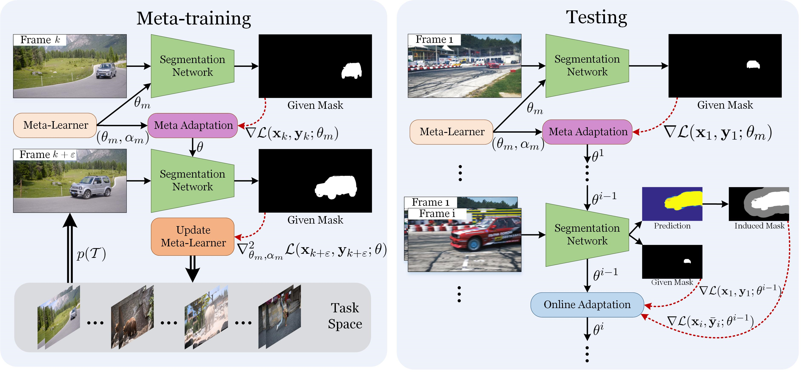

# Online Meta Adaptation for Fast Video Object Segmentation



### Introduction
This is the implementation of our PAMI work `Online Meta Adaptation for Fast Video Object Segmentation`.

### Installation:
1. Clone the MVOS repository
   ```Shell
   git clone https://github.com/huaxinxiao/MVOS-OL.git
   ```
2. Install - if necessary - the required dependencies:
   
   - Python (tested with Anaconda 2.7 and 3.6) 
   - PyTorch (`conda install pytorch torchvision -c pytorch` - tested with PyTorch 0.3, CUDA 8.0)
   
### Useage:
1. Download and softlink the [DAVIS datasets](https://davischallenge.org/).
   ```Shell 
   ls -s /your/davis/JPEGImages/ ./dataset/davis/
   ```
   
   For DAVIS-17, we split the multiple instances from the same video and name the file as `/Annotations/480p_split`.
   ```Shell 
   ls -s /your/davis/Annotations/ ./dataset/davis/
   ```

2. Download the pre-trained segmentation and meta models and put them under `./snapshots/`.

   [Pre-trained base segmentation model](https://drive.google.com/open?id=1qz8ax4r0hSNvTdP-BsiBE1pJJx-KSVab)
   
   [Pre-trained meta model for davis16](https://drive.google.com/open?id=1MisClqoIlwDgDz0uKKUt7mncnypEuPi8)
   
   [Pre-trained meta model for davis17](https://drive.google.com/open?id=15nvuEh2b01JPz3nCNHD6g8gOdk8NTI6d)

3. Run the demo script.

   `demo_mvos_davis1X.py` shows the process of meta adaptation on the first frame.
   
   `demo_mvos_ol_davis1X.py` shows the process of online meta adaptation.
 
### Results:
   [DAVIS16](https://drive.google.com/open?id=1-TPokBw2K9faQHNQfH6E_UuGulxP-1nS)
   
   [DAVIS17](https://drive.google.com/open?id=1OdcwMEyWeNR2q3bmCEHrRgSvAvWRMXyN)

### Citiation:
```
@article{xiao2018online,
	title={Online Meta Adaptation for Fast Video Object Segmentation},
	author={Huaxin Xiao and Bingyi Kang and Yu Liu and Maojun Zhang and Jiashi Feng},
	journal={{IEEE} Trans. Pattern Anal. Mach. Intell.},
	year={2018}
}
```
